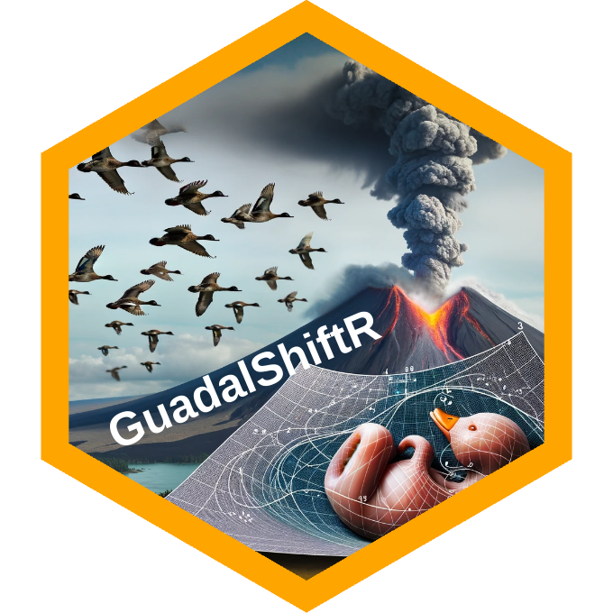

::: {#top}
:::

<br />

[](https://creativecommons.org/licenses/by-nc/4.0/) [](https://zenodo.org/badge/latestdoi/)

<br />

# The GuadalShiftR project

<br />

<!-- TABLE OF CONTENTS -->

<!-- PROJECT LOGO -->



<summary>Table of Contents</summary>

<ol>

<li>

<a href="#about">About</a>

<ul>

<li><a href="#credit-authorship">CRediT authorship</a></li>

</ul>

<ul>

<li><a href="#abstract">Abstract</a></li>

</ul>

<ul>

<li><a href="#built-with">Built With</a></li>

</ul>

</li>

<li>

<a href="#reproducible-workflow">Reproducible workflow</a>

<ul>

<li><a href="#prerequisites">Prerequisites</a></li>

<li><a href="#workflow">Workflow</a></li>

</ul>

</li>

<li><a href="#roadmap">Roadmap</a></li>

<li><a href="#license">License</a></li>

<li><a href="#contact">Contact</a></li>

<li><a href="#r-packages-used-in-this-project">R packages used in this project</a></li>

</ol>

<br />

<!-- ABOUT THE PROJECT -->

## About

This is the GitHub hosting of the project [GuadalShiftR](https://github.com/palmaraz/GuadalShiftR). The paper associated to the project is published in the journal [Biological Conservation](https://www.sciencedirect.com/journal/biological-conservation). See the `CITATION` file for a BibTex entry to the article. This folder contains the files needed to reproduce all the results of the project, and compile the manuscript of the associated paper.

### CRediT authorship

This project was conducted by:

· [Pablo Almaraz](https://scholar.google.es/citations?user=GDFS1v0AAAAJ&hl) (see [contact](#contact) below), which conceived the study, designed and conducted the analyses, and led manuscript writing.

· [Andrew J. Green](https://scholar.google.es/citations?user=wTg9HCcAAAAJ&hl=es), which participated in study conception and participated in manuscript writing.

The major goal of the project is...

<p align="right">

(<a href="#top">back to top</a>)

</p>

<br />

<p align="center">
<a href="https://github.com/palmaraz/GuadalShiftR">  </a>
</p>

### Abstract

Ecological modeling has been traditionally dominated by a focus on the asymptotic behavior, but transient dynamics can have a profound effect on species and community persistence. We show a strong non-stationary coupling of ecological drivers in one of the world's major Mediterranean ecosystems, Doñana wetlands, which is currently threatened by many stressors. Recurrent changes in precipitation fluctuations triggered sudden reorganizations in community trends and population dynamics of a guild of ten wintering waterfowl species during a 36-year period. An anomalously dry and cold transient period in the Northern Hemisphere induced by the volcanic eruption of Mt. Pinatubo in 1991, prompted an abrupt shift to an alternative regime of fluctuating species densities. Most species did not recover previous values even though local weather patterns and large-scale climatic conditions returned to normal values. Although the dynamical stability of the community is similar in both regimes, structural stability declined: the probability of feasibility dropped across time due to depressed population densities at equilibrium. A stochastic cusp catastrophe model fitted to the time series data suggests that the spatio-temporal persistence of cold and dry conditions in the wintering areas, coupled with warm and wet conditions in the breeding grounds, modulated local ecological conditions and induced hysteresis through behavioral shifts to alternative wintering sites. Our study provides empirical evidence for the existence of a catastrophic bifurcation triggered by a tipping point in the dynamics of an imperiled terrestrial vertebrate community, highlighting the relevance of history and multi-stability in explaining current patterns in biological conservation.

</p>

<p align="center">
<a href="https://www.copernicus.eu/">  </a>
</p>

(<a href="#top">back to top</a>)

</p>

### Built With

This is a [workflowr](https://workflowr.github.io/workflowr/) project bootstraped by a suite of open-source tools.

-   [GNU/Linux](https://www.gnu.org/)
-   [ubuntu Budgie](https://ubuntubudgie.org/)
-   [GNU Make](https://www.gnu.org/software/make/)
-   [C++](https://isocpp.org/)
-   [gpp](https://logological.org/gpp)
-   [TexStudio](https://www.texstudio.org/)
-   [JAGS](https://sourceforge.net/projects/mcmc-jags/)
-   [Stan](https://mc-stan.org/)
-   [R](https://cran.r-project.org/)
-   [RStudio](https://www.rstudio.com/)

A suite of [R](https://cran.r-project.org/) packages were used in this project. I am [grateful](https://github.com/Pakillo/grateful) to all the people involved in the development of these open-source packages. Run the following [R](https://cran.r-project.org/) command from within the project for producing a reference list of the packages used:

``` r
grateful::cite_packages(include.RStudio=T, cite.tidyverse=T,
                        out.format = "Rmd",
                        out.file = "rpackages",
                        bib.file = "rpackages-refs",
                        out.dir = file.path(getwd(), "analysis"))
```

A list of these packages is placed at the [end](#r-packages-used-in-this-project) of this document.

<p align="right">

(<a href="#top">back to top</a>)

</p>

<!-- GETTING STARTED -->

## Reproducible workflow

This section shows how to reproduce the results of the accompanying paper. The folder `./code` has the following structure:

``` bash
.
├── functions.R
├── SSRDLVR_model.JAGS
└── SSRDLVR_script.R
```

In this folder, the file `./code/functions.R` contains all the functions necessary to conduct the analyses. The file `./code/SSRDLVR_model.JAGS` contains the state-space regime-dependent Lotka-Volterra model ([SSRDLVR](https://github.com/palmaraz/GuadalShiftR/blob/master/code/SSRDLVR_model.JAGS)) developed in the [accompanying paper](https://www.sciencedirect.com/journal/biological-conservation/special-issue/10DNPT6S9QV) written in the [JAGS](https://sourceforge.net/projects/mcmc-jags/) language.

The [data](https://github.com/palmaraz/GuadalShiftR/tree/master/data) folder has the following structure:

``` bash
.
├── Aerial_count_data.csv
└── Environmental_data.csv
```

The [manuscript](https://github.com/palmaraz/GuadalShiftR/tree/master/manuscript) folder has the following structure:

``` bash
.
├── biblio.bib
├── main_text.tex
├── processed_figs
│   ├── Common_Trends.pdf
│   ├── Cusp_diagram.pdf
│   ├── Environ_clim_ts.pdf
│   └── NOAA_CAR.pdf
└── supp_mat.tex
```

<p align="right">

(<a href="#top">back to top</a>)

</p>

#### Prerequisites

Prior to reproducing the results, make sure to have installed all the necessary software. In particular, you need [JAGS](https://sourceforge.net/projects/mcmc-jags/), [Stan](https://mc-stan.org/) and [R](https://cran.r-project.org/). The [R](https://cran.r-project.org/) libraries needed to reproduce the results (see [below](#r-packages-used-in-this-project)) will be automatically installed by the package [librarian](https://github.com/DesiQuintans/librarian).

### Workflow

The [SSRDLVR](https://github.com/palmaraz/GuadalShiftR/blob/master/code/SSRDLVR_model.JAGS) is fitted through Bayesian MCMC methods using Gibbs sampling, and runs in [JAGS](https://sourceforge.net/projects/mcmc-jags/): even though [JAGS](https://sourceforge.net/projects/mcmc-jags/) is written in the [C++](https://isocpp.org/) language, the code can take several hours to run depending on the architecture used.

You can reproduce the results of the accompanying paper with three methods:

1.  The first, easiest way to reproduce all the analyses in the project is to use the `Makefile`. With simple [GNU Make](https://www.gnu.org/software/make/) syntax, you can reproduce all the project, from statistical analyses to manuscript production. For example, in [GNU/Linux](https://www.gnu.org/) based systems, you can point with the command shell to the project folder and run the following command:

    ``` sh
    make all
    ```

    This command will first conduct all the statistical analyses in the project, and produce all the figures. It then will assemble and compile the manuscript and associated supplementary materials with the necessary figures. Finally, it will open the files. Alternatively, note that you can run this command within [RStudio](https://www.rstudio.com/) from the Terminal tab. 

2.  From within `R`, simply `source` the file `MAKEFILE.R`. This will perform all the analyses of the paper in the required order.

3.  The final method is to open the R Markdown file `./analysis/Reproduce.Rmd` to interactively execute the workflow.

<p align="right">

(<a href="#top">back to top</a>)

</p>

<!-- LICENSE -->

## License

Distributed under a [Creative Commons Attribution-NonCommercial-ShareAlike 4.0 International License](http://creativecommons.org/licenses/by-nc-sa/4.0/?ref=chooser-v1). See `LICENSE` for more information.

<p align="right">

(<a href="#top">back to top</a>)

</p>

<!-- CONTACT -->

## Contact {#contact}

Pablo Almaraz - [\@palmaraz_Eco](https://twitter.com/palmaraz_Eco) - [palmaraz\@gmail.com](mailto:palmaraz@gmail.com)

Personal webpage: <https://palmaraz.github.io/>

Project Link: <https://github.com/palmaraz/GuadalShiftR>

<p align="center">
<a href="https://github.com/palmaraz/GuadalShiftR">  </a>
</p>

(<a href="#top">back to top</a>)

</p>

## R packages used in this project {#r-packages-used-in-this-project}

<p align="right">

</p>

We used R version 4.3.2 (R Core Team 2023a) and the following R packages: bayesplot v. 1.10.0 (Gabry et al. 2019; Gabry and Mahr 2022), bayestestR v. 0.13.1 (Makowski, Ben-Shachar, and Lüdecke 2019), librarian v. 1.8.1 (Quintans 2021), MASS v. 7.3.60.0.1 (Venables and Ripley 2002), numDeriv v. 2016.8.1.1 (Gilbert and Varadhan 2019), parallel v. 4.3.2 (R Core Team 2023b), reshape2 v. 1.4.4 (Wickham 2007), rmarkdown v. 2.25 (Xie, Allaire, and Grolemund 2018; Xie, Dervieux, and Riederer 2020; Allaire et al. 2023), rstan v. 2.32.5 (Stan Development Team 2024), runjags v. 2.2.2.1.1 (Denwood 2016), tidyverse v. 2.0.0 (Wickham et al. 2019), workflowr v. 1.7.1 (Blischak, Carbonetto, and Stephens 2019), running in RStudio v. 2023.6.1.524 (Posit team 2023).

(<a href="#top">back to top</a>)

## Package citations

Allaire, JJ, Yihui Xie, Christophe Dervieux, Jonathan McPherson, Javier
Luraschi, Kevin Ushey, Aron Atkins, et al. 2023.
*<span class="nocase">rmarkdown</span>: Dynamic Documents for r*.
<https://github.com/rstudio/rmarkdown>.

Blischak, John D, Peter Carbonetto, and Matthew Stephens. 2019.
“Creating and Sharing Reproducible Research Code the Workflowr Way.” *F1000Research* 8 (1749).
<https://doi.org/10.12688/f1000research.20843.1>.

Denwood, Matthew J. 2016. “<span class="nocase">runjags</span>: An R
Package Providing Interface Utilities, Model Templates, Parallel
Computing Methods and Additional Distributions for MCMC Models in JAGS.”
*Journal of Statistical Software* 71 (9): 1–25.
<https://doi.org/10.18637/jss.v071.i09>.

Gabry, Jonah, and Tristan Mahr. 2022.
“<span class="nocase">bayesplot</span>: Plotting for Bayesian Models.”
<https://mc-stan.org/bayesplot/>.

Gabry, Jonah, Daniel Simpson, Aki Vehtari, Michael Betancourt, and
Andrew Gelman. 2019. “Visualization in Bayesian Workflow.” *J. R. Stat.
Soc. A* 182: 389–402. <https://doi.org/10.1111/rssa.12378>.

Gilbert, Paul, and Ravi Varadhan. 2019.
*<span class="nocase">numDeriv</span>: Accurate Numerical Derivatives*.
<https://CRAN.R-project.org/package=numDeriv>.

Makowski, Dominique, Mattan S. Ben-Shachar, and Daniel Lüdecke. 2019.
“<span class="nocase">bayestestR</span>: Describing Effects and Their
Uncertainty, Existence and Significance Within the Bayesian Framework.”
*Journal of Open Source Software* 4 (40): 1541.
<https://doi.org/10.21105/joss.01541>.

Posit team. 2023. *RStudio: Integrated Development Environment for r*.
Boston, MA: Posit Software, PBC. <http://www.posit.co/>.

Quintans, Desi. 2021. *<span class="nocase">librarian</span>: Install,
Update, Load Packages from CRAN, “GitHub,” and “Bioconductor” in One
Step*. <https://CRAN.R-project.org/package=librarian>.

R Core Team. 2023a. *R: A Language and Environment for Statistical
Computing*. Vienna, Austria: R Foundation for Statistical Computing.
<https://www.R-project.org/>.

———. 2023b. *R: A Language and Environment for Statistical Computing*.
Vienna, Austria: R Foundation for Statistical Computing.
<https://www.R-project.org/>.

Stan Development Team. 2024. “RStan: The R Interface to Stan.”
<https://mc-stan.org/>.

Venables, W. N., and B. D. Ripley. 2002. *Modern Applied Statistics with
s*. Fourth. New York: Springer. <https://www.stats.ox.ac.uk/pub/MASS4/>.

Wickham, Hadley. 2007. “Reshaping Data with the
<span class="nocase">reshape</span> Package.” *Journal of Statistical
Software* 21 (12): 1–20. <http://www.jstatsoft.org/v21/i12/>.

Wickham, Hadley, Mara Averick, Jennifer Bryan, Winston Chang, Lucy
D’Agostino McGowan, Romain François, Garrett Grolemund, et al. 2019.
“Welcome to the <span class="nocase">tidyverse</span>.” *Journal of Open
Source Software* 4 (43): 1686. <https://doi.org/10.21105/joss.01686>.

Xie, Yihui, J. J. Allaire, and Garrett Grolemund. 2018. *R Markdown: The
Definitive Guide*. Boca Raton, Florida: Chapman; Hall/CRC.
<https://bookdown.org/yihui/rmarkdown>.

Xie, Yihui, Christophe Dervieux, and Emily Riederer. 2020. *R Markdown
Cookbook*. Boca Raton, Florida: Chapman; Hall/CRC.
<https://bookdown.org/yihui/rmarkdown-cookbook>.

(<a href="#top">back to top</a>)

</p>
